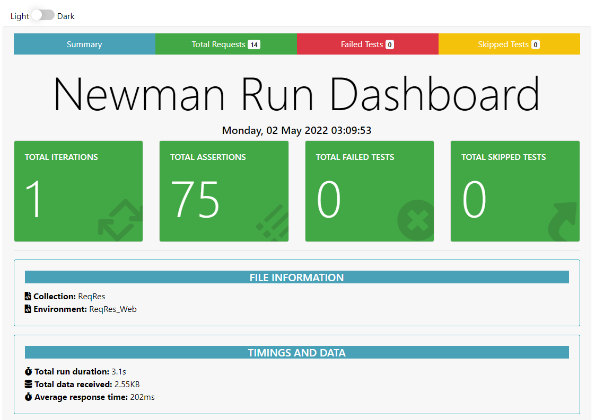

# Postman Newman

A sample API test automation project using [Postman](https://www.postman.com/), [Newman](https://www.npmjs.com/package/newman), and [newman-reporter-htmlextra](https://github.com/DannyDainton/newman-reporter-htmlextra#readme)

## ReqRes

The API chosen for testing was ReqRes. It simulates how a real application behaves, is highly available and accessible from anywhere. For more information, visit their website [here](https://reqres.in/).

## How it works

The project has a Postman collection with tests verifying the status codes, response headers and response bodies of the endpoints of the API. There is also a Postman environment with the base URL of the API.  
The test are automated using Newman and GitHub Actions. A workflow is setup that installs Node.js, Newman, and htmlextra. Newman runs all the tests in the collection and the HTML report generated by htmlextra is uploaded as an artifact that can be downloaded later.  
The HTML results are also being published using GitHub Pages and can be viewed [here](https://kafziel4.github.io/postman-newman/).

